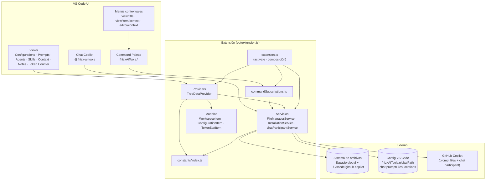

# 📋 Informe de Contexto — Fhizx AI Tools Manager

> **Proyecto:** `fhizx-ai-tools-manager` — Extensión de Visual Studio Code
> **Versión analizada:** 1.4.0 (`package.json`) · Fuente en `src/`
> **Fecha del análisis:** 2026-08-03
> **Rol del análisis:** Arquitecto de Software Senior — Revisión de contexto para futuras implementaciones

---

## 1. Resumen Ejecutivo y Dominio de Negocio

### 🎯 Propósito
**Fhizx AI Tools Manager** es una extensión de VS Code que centraliza, organiza y gestiona el ecosistema personal de "herramientas de IA" del usuario (prompts, agents, skills, context y notes) en un **espacio global** independiente del proyecto abierto. Su valor principal:

1. **Gestión centralizada de recursos** de IA (crear, renombrar, eliminar, navegar) desde la barra lateral del editor.
2. **Integración con GitHub Copilot**: instala/desinstala recursos copiándolos a `~/.vscode/github-copilot/<categoría>/` y registrándolos en `chat.promptFilesLocations`, de modo que Copilot los consuma como *prompt files*.
3. **Interfaz de chat** (`@fhizx-ai-tools`) para invocar recursos por nombre sin salir del chat de Copilot.
4. **Métricas de tokens y costo** del archivo activo (token counter).

### 🧠 Conceptos Clave (Terminología del negocio)

| Término | Definición |
| :--- | :--- |
| **Espacio Global** | Ruta absoluta configurada por el usuario en `fhizxAiTools.globalPath` donde se almacenan todos los recursos. Si no existe, la extensión crea las subcarpetas de categorías automáticamente. |
| **Categoría** | Tipo de recurso gestionado: `prompts`, `agents`, `skills`, `context`, `notes` (constante `CATEGORIES`). |
| **Recurso** | Archivo Markdown (`.prompt.md` para prompts/agents/skills/context; `.md` para notes) o carpeta dentro del espacio global. |
| **Instalado en Copilot** | Estado de un recurso cuyo archivo fue copiado a `~/.vscode/github-copilot/<categoría>/`. Se refleja con icono ✅/❌ (tema `testing-passed-icon` / `notebook-state-error`). |
| **Prompt Files Locations** | Configuración de VS Code (`chat.promptFilesLocations`) que registra carpetas de las que Copilot lee archivos de prompt. |
| **Boilerplate** | Plantilla Markdown con estructura recomendada que se genera al crear un recurso nuevo (según categoría). |
| **Prefijo de archivo** | Convención de naming: `p-` (prompts), `a-` (agents), `s-` (skills), `c-` (context). `notes` no usa prefijo. |
| **Chat Participant** | Participante de chat registrado (`@fhizx-ai-tools`) que permite cargar recursos con el comando `usar <nombre>`. |

---

## 2. Casos de Uso y Actores

### 👥 Actores / Roles

| Actor | Interacción |
| :--- | :--- |
| **Usuario Final** | Usa las vistas, comandos y menús contextuales de la extensión; configura la ruta global; interactúa con el chat participant. |
| **VS Code (Host)** | Ejecuta los comandos (`fhizxAiTools.*`), renderiza los `TreeDataProvider`, dispara eventos (`onDidChangeConfiguration`, `onDidChangeActiveTextEditor`, `onDidChangeTextDocument`). |
| **GitHub Copilot** | Servicio externo que lee los *prompt files* desde `~/.vscode/github-copilot/<categoría>/` y ejecuta el chat participant. |
| **Sistema de Archivos** | Persistencia de los recursos (leer/crear/renombrar/eliminar/copiar). |
| **Evento / Cron** | Activación `onStartupFinished` y verificación de configuración al arrancar; sincronización con Copilot al activarse (`ensureCopilotPromptConfig`). |

### ✅ Casos de Uso Principales (Happy Path)

1. **Configurar Ruta Global** (`fhizxAiTools.setGlobalPath`): el usuario selecciona una carpeta → se guarda en `fhizxAiTools.globalPath` → se crean las 5 subcarpetas de categoría → se refrescan todas las vistas. Al primer arranque sin ruta, la extensión muestra un mensaje de bienvenida con acceso directo.
2. **Crear Recurso** (`fhizxAiTools.create<X>File` / `create<X>Folder`): el usuario nombra el archivo/carpeta → se aplica prefijo y extensión correcta según categoría → se genera boilerplate → se abre el archivo en el editor.
3. **Navegar y Abrir**: el usuario explora el árbol de recursos y hace clic → `fhizxAiTools.openFile` muestra el documento.
4. **Enviar al Chat** (`fhizxAiTools.sendToChat`): el contenido del recurso se inyecta como `query` parcial en el chat de Copilot (`workbench.action.chat.open`); si falla, *fallback* a portapapeles.
5. **Copiar al Portapapeles** (`fhizxAiTools.copyToClipboard`).
6. **Instalar / Desinstalar en Copilot** (`fhizxAiTools.installItem` / `uninstallItem`): copia/elimina el archivo en `~/.vscode/github-copilot/<categoría>/` con conversión a `.prompt.md` y registra la carpeta en `chat.promptFilesLocations`.
7. **Token Counter**: con el editor activo, muestra en tiempo real tokens exactos (js-tiktoken, `cl100k_base`), caracteres, palabras, líneas y costo estimado por 4 modelos.
8. **Chat Participant `usar <nombre>`**: `@fhizx-ai-tools usar <x>` → búsqueda recursiva en prompts/agents/skills/context → respuesta markdown con el contenido del recurso.

### 🔀 Casos de Uso Secundarios y Alternativos

- **Cancelación de creación/renombrado**: si el usuario cancela el `InputBox`, el flujo termina sin efectos.
- **Nombre duplicado**: creación o renombrado aborta con `showErrorMessage` si ya existe.
- **Ruta global no configurada**: creación de recursos y chat participant muestran advertencia/instrucción en vez de operar.
- **Chat sin soporte de query**: `sendToChat` falla → copia al portapapeles + abre el chat + notifica.
- **Instalación de extensiones alternativas**: `.md` y `.instructions.md` se convierten a `.prompt.md` antes de instalar (`getTargetFileName`).
- **Activar sin ruta configurada**: las vistas devuelven listas vacías; `ensureCopilotPromptConfig` registra carpetas de Copilot existentes en silencio.
- **Token counter sin archivo activo**: muestra ítem informativo "Sin archivo activo"; si `tiktoken` falla, estima tokens como `caracteres/4`.
- **Eliminación de recurso**: confirmación modal obligatoria; si se cancela, no se elimina nada.

### 🔒 Precondiciones y Postcondiciones

| Caso de Uso | Precondiciones | Postcondiciones |
| :--- | :--- | :--- |
| Configurar Ruta Global | VS Code corriendo; extensión activa | `fhizxAiTools.globalPath` persistido a nivel Global; 5 carpetas de categoría creadas; vistas refrescadas |
| Crear archivo | Ruta global configurada; nombre no duplicado | Archivo `{prefijo}{nombre}.prompt.md` (o `.md` para notes) creado con boilerplate; abierto en el editor |
| Instalar en Copilot | Recurso tipo archivo (no carpeta); no instalado aún | Archivo copiado a `~/.vscode/github-copilot/<categoría>/` como `.prompt.md`; carpeta registrada en `chat.promptFilesLocations`; vista refrescada (icono ✅) |
| Chat participant | Ruta global configurada; recurso existente | Respuesta markdown con contenido del recurso; sin cambios en disco |
| Token counter | Editor con archivo abierto | Estadísticas actualizadas en la vista (reactivo a cambios de documento) |

---

## 3. Arquitectura y Flujo de Datos

### 🏗️ Patrón de Arquitectura
Extensión de VS Code **monolítica y modular por capas**, estilo **Provider-Service**:

- **Capa de Presentación (Providers)**: `TreeDataProvider`s que alimentan las vistas de la barra lateral (`workspaceTreeDataProvider`, `TokenCounterTreeDataProvider`, `ConfigurationTreeDataProvider`).
- **Capa de Servicios (Dominio)**: lógica de negocio sobre el sistema de archivos y configuración (`FileManagerService`, `InstallationService`) y la integración con chat (`chatParticipantService`).
- **Capa de Modelos**: envoltorios de `vscode.TreeItem` (`WorkspaceItem`, `ConfigurationItem`, `TokenStatItem`).
- **Capa de Presentación/Orquestación**: `extension.ts` (composición del grafo de dependencias) y `commandSubscriptions.ts` (registro de comandos).
- **Config centralizada**: `constants/index.ts` evita literales repetidos (IDs, comandos, rutas, precios, íconos).

No es Clean Architecture estricta ni BLoC/MVVM: es el patrón canónico de extensiones VS Code (TreeDataProvider + EventEmitter + command registration), con una separación de responsabilidades pragmática.

### 🔄 Flujo de la Información

**Escritura (crear recurso):**
1. Usuario pulsa botón/menú → VS Code ejecuta el comando `fhizxAiTools.create<X>File` (registrado dinámicamente).
2. `commandSubscriptions` delega en `FileManagerService.createNewFile(category, refreshAll)`.
3. El servicio resuelve la ruta base (`getGlobalCategoryPath()`), pide el nombre con `showInputBox`, aplica prefijo + extensión y escribe el archivo con `fs.writeFileSync` (contenido boilerplate).
4. `refreshAll()` dispara `_onDidChangeTreeData.fire()` en todos los providers → VS Code vuelve a llamar `getChildren()` → la vista refleja el cambio.

**Lectura (token counter):**
1. Eventos de VS Code (`onDidChangeActiveTextEditor`, `onDidChangeTextDocument`) → `refresh()` del provider.
2. `getChildren()` lee `editor.document.getText()`, calcula tokens con js-tiktoken y costos con precios de `constants`, y devuelve ítems `TokenStatItem`.

**Integración (instalar en Copilot):**
1. Comando `installItem` → `InstallationService.installItem(node, category)`.
2. Copia el archivo a `~/.vscode/github-copilot/<categoría>/` (conversión a `.prompt.md`).
3. `updateCopilotConfig` registra la carpeta en `chat.promptFilesLocations` (Global).
4. `refreshAll()` → `getChildren()` consulta `InstallationService.isInstalled()` → icono ✅/❌.

### 🎛️ Manejo de Estado
- **Reactividad de vistas**: `EventEmitter` privado `_onDidChangeTreeData` + `refresh()` en cada provider (patrón oficial de TreeDataProvider).
- **Estado persistente**: configuración de VS Code (target `Global`): `fhizxAiTools.globalPath` (ruta) y `chat.promptFilesLocations` (carpetas Copilot).
- **Derivado del sistema de archivos**: el estado de "instalado" se calcula en cada render (`isInstalled()`), no se cachea.
- **Eventos externos**: `ConfigurationTreeDataProvider` se auto-refresca con `onDidChangeConfiguration` (namespace `fhizxAiTools`); el token counter escucha cambios de editor/documento.

---

## 4. Componentes Clave y Mapa de Responsabilidades

### 🧩 Módulos / Clases Principales (SRP)

| Componente | Archivo | Responsabilidad única |
| :--- | :--- | :--- |
| `activate()` | `src/extension.ts` | Composición del grafo: instancia providers, servicios y comandos; verificación inicial de config; `ensureCopilotPromptConfig` |
| `workspaceTreeDataProvider` | `src/providers/workspaceTreeDataProvider.ts` | Render del árbol de archivos/carpetas de una categoría; validación de extensiones; estado instalado |
| `TokenCounterTreeDataProvider` | `src/providers/tokenCounterProvider.ts` | Estadísticas y costos del archivo activo |
| `ConfigurationTreeDataProvider` | `src/providers/configurationTreeDataProvider.ts` | Vista "Configurations" (acciones y estado de la ruta global) |
| `FileManagerService` | `src/services/fileManagerService.ts` | CRUD de recursos: crear archivos/carpetas, boilerplates, búsqueda recursiva, resolución de categoría |
| `InstallationService` | `src/services/installationService.ts` | Instalar/desinstalar en Copilot y actualizar `chat.promptFilesLocations` (métodos estáticos) |
| `registerChatParticipant` | `src/services/chatParticipantService.ts` | Registro del participante `@fhizx-ai-tools` y lógica del comando `usar <nombre>` |
| `registerCommands` | `src/suscriptions/commandSubscriptions.ts` | Registro de todos los comandos `fhizxAiTools.*` (incl. generadores dinámicos por categoría) |
| `WorkspaceItem` | `src/models/workspaceItemModel.ts` | TreeItem de archivo/carpeta con contextValue, icono de estado y comando de apertura |
| `ConfigurationItem` | `src/models/configurationItemModel.ts` | TreeItem de la vista de configuración |
| `TokenStatItem` | `src/models/tokenStatItemModel.ts` | TreeItem de estadística del token counter |
| Constantes | `src/constants/index.ts` | Fuente única de IDs, comandos, rutas, prefijos, extensiones, íconos, precios y tipos derivados (`CategoryType`) |

### 🔗 Dependencias Críticas

| Dependencia | Versión | Rol |
| :--- | :--- | :--- |
| **VS Code API** (`@types/vscode`) | ^1.85.0 | Contratos fundamentales: `TreeDataProvider`, `TreeItem`, comandos, menús, config, chat API (`createChatParticipant`), `revealFileInOS` (no usado aún) |
| **`js-tiktoken`** | ^1.0.12 | Encoder `cl100k_base` para el conteo exacto de tokens |
| **Node core** (`fs`, `path`, `os`) | — | Acceso al sistema de archivos y rutas de home (`COPILOT_BASE_DIR`) |
| **TypeScript** | ^5.x | Compilación (`tsc -p ./` → `out/`) |
| **vsce** (tooling) | externo | Empaquetado `.vsix` en `src/versions/` |

> ⚠️ La dependencia de runtime es únicamente `js-tiktoken`; el resto es API de VS Code y Node core.

---

## 5. Puntos de Extensión (Extension Points)

### 🧷 Puntos de Acople (dónde insertar código nuevo)

1. **Nueva categoría de recurso** (ej. `snippets`): tocar **5 lugares coordinados**:
   - `src/constants/index.ts`: añadir a `CATEGORIES` (y `COPILOT_CATEGORIES` si aplica a Copilot) + `FILE_PREFIXES`.
   - `package.json`: nueva entrada en `views.fhizx-ai-tools-container`, comandos `create<X>File/Folder` y menús `view/title`.
   - `src/extension.ts`: nueva instancia `new workspaceTreeDataProvider("<cat>")` + registro de TreeDataProvider + `refreshAll()`.
   - `src/services/fileManagerService.ts`: caso en `getBoilerplateContent`.
   - `src/suscriptions/commandSubscriptions.ts`: la generación dinámica de comandos ya cubre automáticamente cualquier categoría de `CATEGORIES` (flatMap sobre `create${Capitalize}File/Folder`).
2. **Nuevo comando**: añadir clave en `COMMANDS` (constants) → registrar en `registerCommands` → declarar en `contributes.commands` + menús de `package.json`.
3. **Nuevo provider/vista**: clase `TreeDataProvider` en `src/providers/` → modelo en `src/models/` → registro en `extension.ts` → ID en `VIEW_IDS` → declaración en `package.json`.
4. **Nuevo modelo de costo en Token Counter**: `MODEL_PRICES` + bloque en `getChildren()` de `tokenCounterProvider.ts`.
5. **Nueva acción de chat**: ampliar el parser de `promptQuery` en `chatParticipantService.ts` (hoy solo soporta `usar <nombre>`).

### 📜 Contratos / Interfaces (implícitos)

- **Provider**: implementar `vscode.TreeDataProvider<T>` con `getTreeItem`, `getChildren` y `EventEmitter.onDidChangeTreeData` + método `refresh()`.
- **Modelo**: extender `vscode.TreeItem` y fijar `contextValue` (strings que enlazan con los `when` de los menús: `folder`, `file_installed`, `file_uninstalled`, `config_*`).
- **Servicios**: `FileManagerService` es instanciable (recibe providers); `InstallationService` es **estático** (`installItem`, `uninstallItem`, `isInstalled`, `getCopilotGlobalPath`).
- **Comandos dinámicos**: convención `fhizxAiTools.create${capitalize(category)}File|Folder` — no registrar a mano, sale del `flatMap`.
- **Tipos**: usar `CategoryType` desde `constants`; **no redefinir** el tipo en servicios/providers.

---

## 6. Guía de Implementación Futura (Checklist)

### 📝 Paso a Paso (añadir una sub-feature similar — ej. nueva categoría)

1. **Definir la categoría** en `src/constants/index.ts` (`CATEGORIES`, `COPILOT_CATEGORIES`, `FILE_PREFIXES`).
2. **Declarar la vista** y comandos en `package.json` (`contributes.views`, `contributes.commands`, `menus.view/title`).
3. **Instanciar y registrar** el provider en `src/extension.ts` (crear provider + `registerTreeDataProvider` + agregar a `refreshAll()`).
4. **Añadir boilerplate** en `FileManagerService.getBoilerplateContent()`.
5. **Verificar menús contextuales** (`view/item/context` + submenu `fhizxAiTools.itemMenu`) con los `contextValue` correctos.
6. **Compilar** (`npm run compile`) y **probar con F5** (`.vscode/launch.json` ya existe).
7. **Empaquetar e instalar** para pruebas reales: `vsce package --out "src/versions/fhizx-ai-tools-manager-<version>.vsix"` y `code --install-extension <vsix> --force` (binario en `/Applications/Visual Studio Code.app/Contents/Resources/app/bin/code`).

### 🧹 Convenciones y Estándares (preservar)

- **Naming de archivos**: prefijos `p-`/`a-`/`s-`/`c-`; extensión `.prompt.md` (menos `notes` → `.md`).
- **Naming de código**: comandos `fhizxAiTools.<verbo>[Objeto]`; vistas `fhizxAiTools.<categoría>`; clases PascalCase (⚠️ `workspaceTreeDataProvider` es la excepción actual).
- **Estructura**: `providers/`, `services/`, `models/`, `suscriptions/` (typo heredado), `constants/`, `versions/`.
- **Centralización**: toda constante repetida vive en `src/constants/index.ts` (nunca literales sueltos).
- **UI en español**: textos de comandos, mensajes y menús en español (títulos de vistas con emoji).
- **Comentarios en español** y marca de sección tipo `// 1. ...` en `extension.ts`.

### 🛡️ Manejo de Errores (contratos obligatorios)

- **Feedback al usuario**: `showWarningMessage` (acciones inválidas, ruta no configurada), `showErrorMessage` (duplicados), `showInformationMessage` (éxitos).
- **Tolerancia a fallos de Copilot**: `try/catch` silencioso con `console.warn` al actualizar `chat.promptFilesLocations` (puede no existir en versiones viejas).
- **Fallback de conteo**: si `tiktoken` lanza, estimar `tokens ≈ caracteres / 4`.
- **Fallback de chat**: si `workbench.action.chat.open` con query falla → portapapeles.
- **Providers resilientes**: `getChildren()` envuelto en `try/catch` que devuelve `[]` ante errores de FS.

---

## 7. Riesgos, Casos Borde y Deuda Técnica

### 🧪 Casos Borde (Edge Cases) a probar

| Escenario | Comportamiento actual / riesgo |
| :--- | :--- |
| Ruta global vacía o con espacios | `getGlobalCategoryPath()` devuelve `undefined` → vistas vacías; al crear, advertencia. No se hace trim en la creación (sí en validación de config). |
| Archivo/carpeta con nombre duplicado | Bloqueado con mensaje de error (bien). |
| Renombrar sin escribir extensión | Se agrega automáticamente la extensión original (`parsedPath.ext`). Si el usuario incluye la extensión, no se duplica. ⚠️ No valida prefijos ni categoría. |
| Eliminar carpeta con contenido | `fs.rmSync(recursive: true, force: true)` — destrucción total con confirmación modal. |
| Categoría `notes` | Extensiones `.md` (excluye `.prompt.md`); sin prefijo; sin instalación en Copilot (`when` de menús excluye notes). |
| Archivos de solo lectura / permisos | `fs.writeFileSync` / `renameSync` lanzarán excepciones **no capturadas** en comandos (pueden romper el host). |
| Archivo gigante en token counter | `encoder.encode` en memoria de forma síncrona en cada cambio de documento — puede congelar el editor con archivos muy grandes. |
| Rutas con caracteres especiales / espacios | `path.join` y `fsPath` los manejan; pero los prefijos de búsqueda del chat (`findFileRecursive`) comparan nombres exactos (case-sensitive) — `usar Mi-Archivo` no encontrará `p-mi-archivo`. |
| Carpeta de Copilot inexistente | `installItem` la crea con `mkdirSync(recursive)`. |
| VS Code sin soporte de `chat.promptFilesLocations` | Se ignora en silencio (`console.warn`). |

### ⚠️ Atención Especial (rendimiento, seguridad, sincronización)

- **Rendimiento**: todo el acceso a FS es **síncrono** (`readdirSync`, `readFileSync`, `copyFileSync`) y se ejecuta en `getChildren()` (llamado por VS Code en cada render y en cada `refresh()`). Con espacios grandes, la vista puede degradarse. La búsqueda recursiva del chat también es síncrona.
- **Seguridad**: no hay validación de que la ruta global no sea un directorio sensible (ej. `/`); el chat participant inyecta contenido de archivos locales en el chat tal cual (riesgo de prompt injection si los recursos vienen de fuentes no confiables).
- **Sincronización con Copilot**: al instalar vía CLI mientras VS Code está abierto, **requiere recargar la ventana (Cmd+R)** para que Copilot detecte los nuevos prompt files. La extensión registra `chat.promptFilesLocations` al activarse, pero no vigila cambios posteriores de `~/.vscode/github-copilot/`.
- **Persistencia del layout**: la vista puede "desaparecer" por `views.customizations` en `state.vscdb` → fix con `Developer: Reset View Locations`.

### 🩹 Deuda Técnica Identificada (hallazgos del análisis)

1. **🔴 Comandos declarados pero NO registrados**: `fhizxAiTools.toggleInstall` y `fhizxAiTools.openGlobalPath` existen en `constants/index.ts` y `package.json` (menús inline de la vista Configurations), pero **no están registrados en `registerCommands`**. Al hacer clic, VS Code lanza "command not found". Falta implementación (el `toggleInstall` debería usar QuickPick instalar/desinstalar; `openGlobalPath` debería usar `revealFileInOS`).
2. **🔴 `contextValue` roto en Configurations**: `ConfigurationItem` **siempre** fija `this.contextValue = "config_info"` e ignora el parámetro `kind`. Los menús de `package.json` esperan `config_status` y `config_action` (`view/item/context`), por lo que los botones inline **nunca se renderizan**. El tipo `ConfigurationItemKind` está definido pero no se usa.
3. **🟠 Icono del chat participant inexistente**: `chatParticipantService.ts` referencia `media/icon.svg`, pero **no existe la carpeta `media/`** en el repo (solo `assets/`). El icono no se muestra (no rompe, pero el recurso apunta a nada).
4. **🟠 Naming inconsistente**: clase `workspaceTreeDataProvider` en minúscula (viola PascalCase del resto); carpeta `suscriptions/` (typo de "subscriptions").
5. **🟠 Tipado `any`**: `FileManagerService` recibe `Record<CategoryType | "tokenCounterProvider", any>` y lo usa para invocar `getGlobalCategoryPath()` — sin verificación de tipos.
6. **🟠 Lógica duplicada**: la resolución de `filePath` (node vs Uri vs activeTextEditor) está repetida en `SEND_TO_CHAT` y `COPY_TO_CLIPBOARD` — extraer a helper.
7. **🟠 Side-effect en getter**: `getChildren()` de `workspaceTreeDataProvider` ejecuta `fs.mkdirSync` si la ruta no existe (efecto de escritura dentro de una operación de lectura).
8. **🟡 Stub**: `fhizxAiTools.checkForUpdates` solo muestra "se encuentra actualizado" — sin lógica real de versionado (aunque hay `src/versions/` con VSIX versionados).
9. **🟡 Categoría por defecto engañosa**: `FileManagerService.getCategoryFromPath()` devuelve `"prompts"` como fallback si no matchea ninguna ruta — puede crear recursos en la categoría equivocada.
10. **🟡 Errores de FS sin capturar**: `createNewFile`, `createNewFolder`, `renameItem`, `deleteItem` no envuelven las operaciones de FS en `try/catch`; un fallo de permisos o disco lleno propagaría la excepción al host de VS Code.
11. **🟡 Sin tests**: no hay suite de pruebas (solo dependencias de dev de TypeScript). Los flujos de FS y naming (prefijos, conversión `.md` → `.prompt.md`, `findFileRecursive`) son candidatos ideales para unit tests.
12. **🟡 Accesibilidad del chat participant**: solo responde al patrón `usar <nombre>` (regex `usar\s+(.+)`); el resto de comandos devuelve ayuda genérica. No hay búsqueda difusa ni sugerencias.

---

## 📌 Recomendaciones Prioritarias (antes de escalar)

1. **Registrar `toggleInstall` y `openGlobalPath`** (deuda #1) y **corregir `contextValue`** según `kind` (`config_status` / `config_action`) — deuda #2 — para que la vista Configurations cumpla lo que promete el README.
2. **Mover `media/icon.svg`** o apuntar `iconPath` a un recurso existente en `assets/`.
3. **Refactorizar acceso síncrono a FS** de `getChildren()` (o al menos medir con espacios grandes).
4. **Envolver operaciones de FS** de comandos de escritura en `try/catch` con `showErrorMessage`.
5. **Extraer helper único** de resolución de `filePath` para `sendToChat`/`copyToClipboard`.
6. **Añadir unit tests** para `InstallationService.getTargetFileName`, `FileManagerService.findFileRecursive` y prefijos (los bugs de naming/conversión son los más propensos a regresión).
